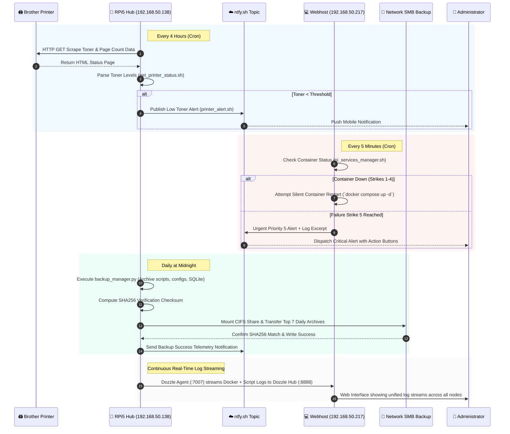

# 🏛️ Gladstone Master Infrastructure Architectural Map & Showcase
**System Architecture:** Hub & Spoke Communication Model  
**Master Nodes:** Central Communication Hub (Raspberry Pi 5) & Application Spoke (Ubuntu Webhost)  
**Document Purpose:** Comprehensive, printable architectural showcase detailing every component, service, container, script, network path, and communication link in the ecosystem.

---

## 📐 System Overview & Topology Map

The Gladstone ecosystem operates on an intelligent **Hub & Spoke** architecture designed for high availability, centralized telemetry, remote control, and automated self-healing.

```mermaid
graph TB
    subgraph Central_Hub [" Raspberry Pi 5 - Communication Hub (192.168.50.138)"]
        direction TB
        PI_CRON["⏰ System Cron Manager"]
        PI_WATCHDOG["🛡️ Watchdog & Health Check\n(pi_services_manager.sh)"]
        PI_NTFY_LISTEN["👂 NTFY Command Listener\n(ntfy_listener.sh :8080)"]
        PI_PRINTER["🖨️ Printer Telemetry Scraper\n(get_printer_status.sh / printer_alert.sh)"]
        PI_SPEEDTEST["🚀 Network Speed Auditor\n(net_speed.sh)"]
        PI_BACKUP["💾 Local Backup Engine\n(pi_backup.sh / backup_manager.py)"]
        PI_DOZZLE_AGENT["🐳 Dozzle Agent Container\n(dozzle-agent :7007)"]
        PI_DASHBOARD["📊 Terminal Dashboard (db)\n(pi-dashboard.sh)"]
    end

    subgraph Webhost_Spoke [" 💻 Ubuntu Laptop - Webhost Node (192.168.50.217)"]
        direction TB
        WEB_WATCHDOG["🛡️ 5-Strike Container Watchdog"]
        WEB_BACKUP_STORAGE["📁 CIFS / Local Storage\n(/mnt/backups/laptopwebhost)"]
        
        subgraph App_Containers ["🐳 Container Stacks"]
            RELAY_CADDY["🌐 RelayIT Caddy Gateway (:80)"]
            RELAY_WEB["🎟️ RelayIT Web App (:8000)"]
            RELAY_DB[(🗄️ RelayIT Postgres DB :5432)]
            HOME_WEB["🏠 HomeAsset App (:8080)"]
            HOME_DB[(🗄️ HomeAsset Postgres DB :5432)]
            JOB_WEB["📋 JobBoard Kanban App (:3001)"]
            GEMINI_API["🤖 Gemini AI API Backend (:5050)"]
            RUST_HBBS["🖥️ RustDesk ID Server (:21115-6)"]
            RUST_HBBR["🔄 RustDesk Relay Server (:21117)"]
        end

        subgraph Telemetry_Stack ["📊 Log & Telemetry Hub"]
            DOZZLE_WEB["👁️ Dozzle Log Dashboard (:8888)"]
            NVR_SYSLOG["📹 NVR Syslog Listener (UDP :514)"]
            LOG_STREAMER["📜 Gladstone Script Streamer"]
        end
    end

    subgraph External_Devices ["🌐 External Hardware & Public Services"]
        BROTHER_PRINTER["🖨️ Brother Network Printer"]
        ANNKE_NVR["📹 ANNKE NVR Camera System"]
        NTFY_CLOUD["☁️ ntfy.sh Pub/Sub Cloud Engine"]
        SMB_SERVER["💾 Central SMB Backup Share\n(//192.168.50.217/Backups)"]
        GEMINI_CLOUD["🧠 Google Gemini AI Cloud API"]
    end

    %% Communication Links
    PI_PRINTER -->|HTTP Scrape / 4-hr| BROTHER_PRINTER
    ANNKE_NVR -->|UDP Syslog Event / :514| NVR_SYSLOG
    PI_DOZZLE_AGENT -->|gRPC Log Stream / :7007| DOZZLE_WEB
    PI_BACKUP -->|SMB / CIFS Mount| SMB_SERVER
    GEMINI_API -->|REST API Requests| GEMINI_CLOUD
    
    PI_WATCHDOG -->|Alert / Priority 5| NTFY_CLOUD
    WEB_WATCHDOG -->|Alert / Priority 5| NTFY_CLOUD
    NTFY_CLOUD -->|PubSub Event Stream| PI_NTFY_LISTEN
    
    RELAY_CADDY -->|Reverse Proxy| RELAY_WEB
    RELAY_WEB -->|SQL Queries| RELAY_DB
    HOME_WEB -->|SQL Queries| HOME_DB

    classDef hubStyle fill:#1e293b,stroke:#38bdf8,stroke-width:2px,color:#fff;
    classDef webStyle fill:#0f172a,stroke:#818cf8,stroke-width:2px,color:#fff;
    classDef extStyle fill:#334155,stroke:#f59e0b,stroke-width:2px,color:#fff;
    class Central_Hub hubStyle;
    class Webhost_Spoke webStyle;
    class External_Devices extStyle;
```



---

## 📡 Master Communication & Data Flow Map



---

## 📦 Detailed Component-by-Component Catalog

### 1. Master Administration & Setup Tools

| Script / File | Node / Scope | Purpose & Functionality | Dependencies |
| :--- | :--- | :--- | :--- |
| **[install.sh](file:///c:/Users/pmitchell/.gemini/antigravity/scratch/Hub&Spoke/pi5-scripts/install.sh)** | Both Nodes | **Universal Gladstone Installer & Bootstrapper.** Performs one-command setup, detects hostname/node identity (`--ntfy` vs `--webhost`), installs Docker Engine, creates `~/.gladstone_mode`, registers systemd services, sets up cron schedules, and installs shell aliases. | `docker`, `curl`, `git`, `cifs-utils`, `jq` |
| **[aliases.sh](file:///c:/Users/pmitchell/.gemini/antigravity/scratch/Hub&Spoke/pi5-scripts/aliases.sh)** | Both Nodes | **Command Shortcut Registry.** Injects simplified CLI aliases into `.bashrc` (`db`, `relay`, `sync`, `update`, `rebuild`, `backup`, `restore`, `reinstall`). | Bash Shell |
| **[bashrc.webhost.template](file:///c:/Users/pmitchell/.gemini/antigravity/scratch/Hub&Spoke/pi5-scripts/bashrc.webhost.template)** | Webhost | **Webhost Shell Environment Template.** Configures environment flags, custom prompt styling, path exports, and container management shortcuts for Webhost nodes. | Bash Shell |
| **[pi_help.sh](file:///c:/Users/pmitchell/.gemini/antigravity/scratch/Hub&Spoke/pi5-scripts/pi_help.sh)** | Both Nodes | **Interactive CLI Documentation Viewer.** Command `pi_help` displays a colorized reference guide for commands, container port mappings, and troubleshooting steps. | Terminal |
| **[cleanup_test.sh](file:///c:/Users/pmitchell/.gemini/antigravity/scratch/Hub&Spoke/pi5-scripts/cleanup_test.sh)** | Both Nodes | **Environment Reset Utility.** Stops all active Docker stacks, unmounts backup network shares, cleans temporary retry files, and resets Gladstone configuration. | Docker, Bash |
| **[services.registry](file:///c:/Users/pmitchell/.gemini/antigravity/scratch/Hub&Spoke/pi5-scripts/services.registry)** | Both Nodes | **Central Service Catalog.** Pipe-delimited catalog mapping daemon names to network ports and human-readable descriptions used by the watchdog daemon. | Text Spec |
| **[SYSTEM_CONTEXT.md](file:///c:/Users/pmitchell/.gemini/antigravity/scratch/Hub&Spoke/pi5-scripts/SYSTEM_CONTEXT.md)** | Repository | **Infrastructure System Context File.** Master technical reference defining server roles, storage paths, containers, schedules, and network configurations. | Markdown |
| **[SOP.MD](file:///c:/Users/pmitchell/.gemini/antigravity/scratch/Hub&Spoke/pi5-scripts/SOP.MD)** | Repository | **Standard Operating Procedures.** Step-by-step procedures for server provisioning, container deployment, backup recovery, and disaster recovery. | Markdown |
| **[readme.md](file:///c:/Users/pmitchell/.gemini/antigravity/scratch/Hub&Spoke/pi5-scripts/readme.md)** | Repository | **Main Repository README.** Overview documentation for the repository, quickstart guides, command table, and architecture summary. | Markdown |

---

### 2. Monitoring, Telemetry & Watchdog Engine

| Script / Service | Node / Scope | Purpose & Functionality | Schedule / Trigger |
| :--- | :--- | :--- | :--- |
| **[pi_services_manager.sh](file:///c:/Users/pmitchell/.gemini/antigravity/scratch/Hub&Spoke/pi5-scripts/pi_services_manager.sh)** | Both Nodes | **5-Strike System & Container Watchdog.** Checks health of all registered containers (`homeasset`, `hbbs`, `hbbr`, `gemini-api`, `jobboard`, `relayit`) and background daemons. Performs 4 silent recovery restarts. On the 5th consecutive failure, sends Urgent Priority 5 alert via ntfy with log snippets. | Every 5 minutes (Cron) |
| **[ntfy_listener.sh](file:///c:/Users/pmitchell/.gemini/antigravity/scratch/Hub&Spoke/pi5-scripts/ntfy_listener.sh)** | RPi5 Hub | **Remote Command Dispatcher Daemon.** Background listener listening on `patrick_mitch_pi5_x9k2v_actions` ntfy pub/sub channel or HTTP port 8080. Converts remote ntfy action triggers into local script executions (sync, backup, restart). | Continuous Daemon |
| **[get_printer_status.sh](file:///c:/Users/pmitchell/.gemini/antigravity/scratch/Hub&Spoke/pi5-scripts/get_printer_status.sh)** | RPi5 Hub | **Brother Printer Web Scraper.** Connects to local network Brother Printer web server, extracts HTML telemetry (black toner status, drum unit life, paper tray state, page count), and saves structured status data to `~/printer_data/`. | Every 4 hours (Cron) |
| **[printer_alert.sh](file:///c:/Users/pmitchell/.gemini/antigravity/scratch/Hub&Spoke/pi5-scripts/printer_alert.sh)** | RPi5 Hub | **Printer Threshold Evaluator.** Reads scraped printer telemetry, checks toner levels against warning thresholds, and sends notifications when toner replacement is required. | Post-scraper trigger |
| **[printer_health.sh](file:///c:/Users/pmitchell/.gemini/antigravity/scratch/Hub&Spoke/pi5-scripts/printer_health.sh)** | RPi5 Hub | **Printer Network Diagnostic Tool.** Performs deep network check, ping test, HTTP port check, and diagnostic audit for printer connectivity. | On-demand / CLI |
| **[net_speed.sh](file:///c:/Users/pmitchell/.gemini/antigravity/scratch/Hub&Spoke/pi5-scripts/net_speed.sh)** | RPi5 Hub | **Network Speed Auditor.** Runs `speedtest-cli`, logs download/upload bandwidth and ping latency to telemetry files, and alerts ntfy if connection drops below SLA thresholds. | Every 6 hours (Cron) |
| **[nvr_syslog.py](file:///c:/Users/pmitchell/.gemini/antigravity/scratch/Hub&Spoke/pi5-scripts/nvr_syslog.py)** | Webhost | **ANNKE NVR Syslog UDP Receiver.** Listens on UDP port 514 for incoming syslog telemetry emitted by ANNKE NVR security camera system and pipes events into Dozzle for live viewing. | Continuous Daemon (Port 514 UDP) |
| **[pi-dashboard.sh](file:///c:/Users/pmitchell/.gemini/antigravity/scratch/Hub&Spoke/pi5-scripts/pi-dashboard.sh)** | RPi5 Hub | **Hub Terminal Dashboard (`db`).** Rich terminal interface showing CPU temperature, RAM/disk consumption, Brother printer toner status, network speed history, and Dozzle agent state. | Interactive CLI |
| **[webhost-dashboard.sh](file:///c:/Users/pmitchell/.gemini/antigravity/scratch/Hub&Spoke/pi5-scripts/webhost-dashboard.sh)** | Webhost | **Webhost Terminal Dashboard (`db`).** Terminal interface displaying Webhost system vitals, Docker container health table, SMB backup mount state, and Dozzle log hub status. | Interactive CLI |

---

### 3. System Backup & Recovery Infrastructure

| Script / Utility | Node / Scope | Purpose & Functionality | Target Storage |
| :--- | :--- | :--- | :--- |
| **[pi_backup.sh](file:///c:/Users/pmitchell/.gemini/antigravity/scratch/Hub&Spoke/pi5-scripts/pi_backup.sh)** | Both Nodes | **Daily Backup Entry Point.** Wrapper shell script invoked by Cron at midnight. Calls `backup_manager.py` with appropriate node identity flags. | Daily at 00:00 (Cron) |
| **[backup_manager.py](file:///c:/Users/pmitchell/.gemini/antigravity/scratch/Hub&Spoke/pi5-scripts/backup_manager.py)** | Both Nodes | **Master Backup & Verification Engine.** Python engine that bundles scripts, configuration files, and database exports into compressed `.tar.gz` archives. Computes SHA256 checksums, mounts SMB share (`//192.168.50.217/Backups/CentralServers`), enforces a strict 7-day retention cycle, and dispatches ntfy alerts. | Python 3 + `cifs-utils` + `smbclient` |
| **[pi_restore.sh](file:///c:/Users/pmitchell/.gemini/antigravity/scratch/Hub&Spoke/pi5-scripts/pi_restore.sh)** | Both Nodes | **Disaster Recovery Entry Point (`restore`).** Interactive shell wrapper that pauses the 5-strike watchdog and launches `restore_manager.py`. | On-demand / CLI |
| **[restore_manager.py](file:///c:/Users/pmitchell/.gemini/antigravity/scratch/Hub&Spoke/pi5-scripts/restore_manager.py)** | Both Nodes | **Interactive System Restoration Manager.** Interactive CLI wizard that scans backup directories, validates SHA256 archive hashes, unpacks files, restores database dumps, and brings Docker stacks back online. | Python 3 |

---

### 4. Git & Stack Deployment Automation

| Script | Purpose & Functionality | CLI Alias |
| :--- | :--- | :--- |
| **[pi_sync.sh](file:///c:/Users/pmitchell/.gemini/antigravity/scratch/Hub&Spoke/pi5-scripts/pi_sync.sh)** | **Automated Repository Synchronization.** Stages changes, generates git commit with system metadata, pushes to GitHub, and dispatches an ntfy notification confirming sync completion. | `sync` |
| **[pi_update.sh](file:///c:/Users/pmitchell/.gemini/antigravity/scratch/Hub&Spoke/pi5-scripts/pi_update.sh)** | **Smart Stack Updater.** Pulls latest git commits from GitHub, checks `~/.gladstone_mode`, and intelligently restarts modified Docker stacks without disrupting unchanged containers. | `update` |
| **[pi_rebuild.sh](file:///c:/Users/pmitchell/.gemini/antigravity/scratch/Hub&Spoke/pi5-scripts/pi_rebuild.sh)** | **Hard Stack Rebuild Engine.** Force-pulls latest container images, rebuilds custom Dockerfiles (e.g. `Dockerfile.gemini`), and recreates container stacks from scratch. | `rebuild` |
| **[sync_repo.sh](file:///c:/Users/pmitchell/.gemini/antigravity/scratch/Hub&Spoke/pi5-scripts/sync_repo.sh)** | **Multi-Node Git Helper.** Helper utility maintaining git repository alignment and SSH key usage across nodes. | Internal Script |
| **[relay.sh](file:///c:/Users/pmitchell/.gemini/antigravity/scratch/Hub&Spoke/pi5-scripts/relay.sh)** | **CLI Notification Dispatcher.** CLI wrapper for sending formatted ntfy messages with titles, priorities, and tags. | `relay` |
| **[apply_schema_fix.sh](file:///c:/Users/pmitchell/.gemini/antigravity/scratch/Hub&Spoke/pi5-scripts/apply_schema_fix.sh)** | **Database Migration Utility.** Applies database schema fixes and SQL patches (`init-db.sql`) to active PostgreSQL containers. | Internal Script |
| **[track_flight.sh](file:///c:/Users/pmitchell/.gemini/antigravity/scratch/Hub&Spoke/pi5-scripts/track_flight.sh)** | **Flight Tracking Telemetry Script.** Fetches flight tracking data via external API/scraper for dashboard display. | Utility Script |

---

### 5. Docker Container Stacks & Application Services

| Stack Name | Compose File | Containers & Services | Port Mappings | Node | Purpose & Functionality |
| :--- | :--- | :--- | :--- | :--- | :--- |
| **RelayIT Support** | **[relayit-compose.yml](file:///c:/Users/pmitchell/.gemini/antigravity/scratch/Hub&Spoke/pi5-scripts/relayit-compose.yml)** | • `relayit-caddy`<br>• `relayit-web`<br>• `relayit-db` | • Port 80 (Caddy Proxy)<br>• Port 8000 (Internal Web)<br>• Port 5432 (Internal DB) | Webhost | **IT Ticket Management Application.** Full-stack IT ticketing solution. FastAPI web backend connected to PostgreSQL 16 database, exposed to LAN via Caddy reverse proxy on Port 80. |
| **HomeAsset Inventory** | **[homeasset-compose.yml](file:///c:/Users/pmitchell/.gemini/antigravity/scratch/Hub&Spoke/pi5-scripts/homeasset-compose.yml)** | • `homeasset`<br>• `homeasset-db` | • Port 8080 (Web App)<br>• Port 5432 (Internal DB) | Webhost | **Home Asset & Inventory Manager.** FastAPI application with PostgreSQL database for tracking home electronics, warranty info, and serial numbers. |
| **JobBoard Kanban** | **[jobboard-compose.yml](file:///c:/Users/pmitchell/.gemini/antigravity/scratch/Hub&Spoke/pi5-scripts/jobboard-compose.yml)** | • `jobboard` | • Port 3001 (Web App) | Webhost | **Job Application Tracker.** Next.js web application with interactive Kanban board, PDF resume caching, and job application tracking. |
| **Gemini AI API Server** | **[gemini-compose.yml](file:///c:/Users/pmitchell/.gemini/antigravity/scratch/Hub&Spoke/pi5-scripts/gemini-compose.yml)**<br>**[Dockerfile.gemini](file:///c:/Users/pmitchell/.gemini/antigravity/scratch/Hub&Spoke/pi5-scripts/Dockerfile.gemini)** | • `gemini-api`<br>*(Source: [gemini_api_server.py](file:///c:/Users/pmitchell/.gemini/antigravity/scratch/Hub&Spoke/pi5-scripts/gemini_api_server.py))* | • Port 5050 (REST API) | Webhost | **Microservice AI Backend Server.** FastAPI wrapper around Google Gemini API. Offers local REST endpoints for AI prompt generation, code analysis, and structured JSON generation. Client reference in `gemini_client_example.js`. |
| **RustDesk Remote Desktop** | **[rustdesk-compose.yml](file:///c:/Users/pmitchell/.gemini/antigravity/scratch/Hub&Spoke/pi5-scripts/rustdesk-compose.yml)** | • `hbbs` (ID Server)<br>• `hbbr` (Relay Server) | • Ports 21115, 21116 (ID)<br>• Port 21117 (Relay) | Webhost | **Self-Hosted Remote Desktop Gateway.** Provides self-hosted signaling (`hbbs`) and relay (`hbbr`) infrastructure for RustDesk remote desktop client connections across the LAN. |
| **Dozzle Log Hub** | **[dozzle-compose.yml](file:///c:/Users/pmitchell/.gemini/antigravity/scratch/Hub&Spoke/pi5-scripts/dozzle-compose.yml)** | • `dozzle`<br>• `nvr-syslog`<br>• `gladstone-scripts-log` | • Port 8888 (Web Hub)<br>• Port 514 UDP (Syslog) | Webhost | **Centralized Telemetry & Log Viewer.** Primary Dozzle log dashboard aggregating Docker container logs, script telemetry streams, and ANNKE camera UDP syslog events into a single real-time UI. |
| **Dozzle Hub Agent** | **[dozzle-agent-compose.yml](file:///c:/Users/pmitchell/.gemini/antigravity/scratch/Hub&Spoke/pi5-scripts/dozzle-agent-compose.yml)** | • `dozzle-agent` | • Port 7007 (Agent Stream) | RPi5 Hub | **Remote Log Streamer Agent.** Dozzle agent container running on Pi5 Hub. Captures local Pi5 Docker logs and shell script telemetry, streaming them to Webhost Dozzle Hub on port 8888. |

---

## 🌐 Master Network Port & Routing Matrix

```
+-----------------------------------------------------------------------------------------+
|                                    NETWORK PORT MAP                                     |
+------+--------------------------+---------------------+---------------+-----------------+
| Port | Service / Container      | Protocol            | Hosting Node  | Purpose         |
+------+--------------------------+---------------------+---------------+-----------------+
| 80   | relayit-caddy            | HTTP                | Webhost       | RelayIT Gateway |
| 514  | nvr-syslog               | UDP                 | Webhost       | ANNKE NVR Logs  |
| 3001 | jobboard                 | HTTP                | Webhost       | Job Tracker UI  |
| 5050 | gemini-api               | HTTP (REST)         | Webhost       | Gemini AI API   |
| 5432 | relayit-db / homeasset-db| PostgreSQL TCP      | Webhost       | Container DBs   |
| 7007 | dozzle-agent             | TCP / gRPC          | RPi5 Hub      | Remote Log Agent|
| 8000 | relayit-web              | HTTP (Internal)     | Webhost       | RelayIT FastAPI |
| 8080 | homeasset                | HTTP                | Webhost       | Home Asset UI   |
| 8888 | dozzle                   | HTTP                | Webhost       | Central Log UI  |
| 21115| hbbs (RustDesk)          | TCP                 | Webhost       | Signaling ID    |
| 21116| hbbs (RustDesk)          | UDP/TCP             | Webhost       | NAT Hole Punch  |
| 21117| hbbr (RustDesk)          | TCP                 | Webhost       | Desktop Relay   |
+------+--------------------------+---------------------+---------------+-----------------+
```

---

## ⏱️ Master Cron Schedule & Automated Lifecycle

```
========================================================================================
GLADSTONE AUTOMATED CRONTAB LIFECYCLE MAP
========================================================================================

 00:00 Daily  -------------------> [ pi_backup.sh ]
                                    └── Invokes backup_manager.py
                                        ├── Tarball compression & SHA256 hashing
                                        ├── SMB CIFS mount to //192.168.50.217/Backups
                                        ├── Enforce 7-day retention rotation
                                        └── ntfy telemetry alert dispatch

 Every 5 Min  -------------------> [ pi_services_manager.sh ]
                                    └── 5-Strike Watchdog Execution
                                        ├── Docker process verification
                                        ├── Registry script daemon check
                                        ├── Strikes 1-4: Silent recovery attempt
                                        └── Strike 5: Priority 5 Urgent Alert

 Every 4 Hrs  -------------------> [ get_printer_status.sh ]
                                    └── Brother Printer Scraper
                                        ├── HTTP status extraction
                                        └── Trigger printer_alert.sh on low toner

 Every 6 Hrs  -------------------> [ net_speed.sh ]
                                    └── Network Bandwidth Audit
                                        ├── speedtest-cli execution
                                        ├── Log bandwidth & ping history
                                        └── Alert ntfy if speed < SLA threshold
========================================================================================
```

---

## 📄 Showcase Presentation & Printing Instructions

1. **For PDF Export / Digital Showcase:**
   - Open this markdown document in VS Code or GitHub viewer.
   - Use the **Markdown: Export to PDF** command or print directly via browser.
2. **For Physical Binder Showcase:**
   - Open the companion interactive HTML document [showcase_printable.html](file:///c:/Users/pmitchell/.gemini/antigravity-ide/brain/7b1c7602-e3c0-4cc5-8a97-e33196cc3a01/showcase_printable.html) in Chrome or Edge.
   - Click the top right **"🖨️ Print Showcase / Save as PDF"** button.
   - Page margins, card boundaries, and visual styling are pre-configured to guarantee crisp, clean page breaks without orphaned headers or truncated diagrams.
